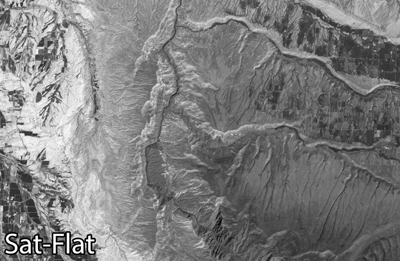
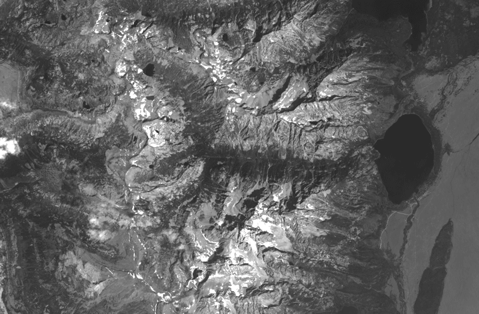

# anaglypher
Python script for making anaglyph-3D maps from a DEM.

## Description
This program takes an image and a digital elevation model (DEM) that are
co-registered and creates a red-cyan anaglyph image by simulating stereo
imagery using the elevation model. The resulting anaglyph image retains the
geolocation, extent, and bit-depth of the input image, so it remains suitable for
use in GIS programs.

### Preprocessing
The image and DEM must be co-registered, so that they have the same dimensions.
Adding such a preprocessing step is a planned addition in the future.

## Requirements
* [gdal with python bindings](http://www.gdal.org/)
* [numpy](http://www.numpy.org/)

## Usage
The software is usable as a script from the command line, which presents the simplest interface.

### Options
* `--dem, -d`: elevation dataset filename
* `--input, -i`: image to anaglyph
* `--output, -o`: anaglyph image to save
* `--altitude, --alt, -a`: elevation/altitude of the observer
* `--separation, --sep, -s`: eye-separation distance of the observer
* `--nadir, -n`: ratio between the left and right eye that points nadir to the ground
* `--plane, -p`: elevation/altitude to place the image-plane
* `--hillshade, -hill`: make a hillshade of the DEM and process it into an anaglyph
* `--lookup, --lut`: speed up the processing by pre-computing shift values using integer approximations of elevation values
* `--nointerp`: speed up the processing by not interpolating pixel brightness, but using whole-pixel shifts

### Examples
**Process a satellite image**
```bash
$ python anaglypher.py --dem elevation.tif --input image.tif --output output.tif \
  --plane 0.0 --altitude 3000 --separation 100
```

**Process a satellite image and make an anaglyph hillshade**
```bash
$ python anaglypher.py --dem elevation.tif --input image.tif --output output.tif \
  --plane 0.0 --altitude 3000 --separation 100 --hillshade
```

**Make image pop-out with low image plane**
```bash
$ python anaglypher.py --dem elevation.tif --input image.tif --output output.tif \
  --plane -2000 --altitude 3000 --separation 100
```

**Make image recessed with high image plane**
```bash
$ python anaglypher.py --dem elevation.tif --input image.tif --output output.tif \
  --plane 2000 --altitude 3000 --separation 100
```

**Use a lookup table to speed computations**
```bash
$ python anaglypher.py --dem elevation.tif --input image.tif --output output.tif \
  --plane 0.0 --altitude 3000 --separation 100 --lookup
```

**Don't use interpolation to speed computations**
```bash
$ python anaglypher.py --dem elevation.tif --input image.tif --output output.tif \
  --plane 0.0 --altitude 3000 --separation 100 --nointerp
```

### Parameterization
Playing with the parameterization will affect the resulting anaglyph map.
The ratio between human height and pupillary distance is around 30.
Decreasing this ratio will simulate higher vertical exaggeration.

As shown above, setting the image plane below the lowest elevation will cause
the anaglyph image to pop-up.
Setting the image plane above the highest elevation will create an anaglyph
image that is recessed.

## Example Results
The results shown below use free products from the United States Geological Survey ([USGS](https://www.usgs.gov/)). DEMs are available as part of the 3D Elevation Program ([3DEP](http://nationalmap.gov/3DEP/index.html)) through the [National Map](http://viewer.nationalmap.gov/basic/?basemap=b1&category=ned,nedsrc&title=3DEP%20View). The imagery used are Landsat 8 scenes (Band 8) acquired through the USGS [Earth Explorer](http://earthexplorer.usgs.gov/).

### Black Canyon of the Gunnison National Park, Colorado


This example uses a high image plane to simulate a shadow box effect for the imagery and hillshade.

### Grand Teton National Park, Wyoming


Even without anaglyph glasses, it is possible to see that high elevations like mountain peaks (Grand Teton at bottom-center of image) are shifted more than low elevations (Jenny Lake, the fan-shaped lake on right of image).
